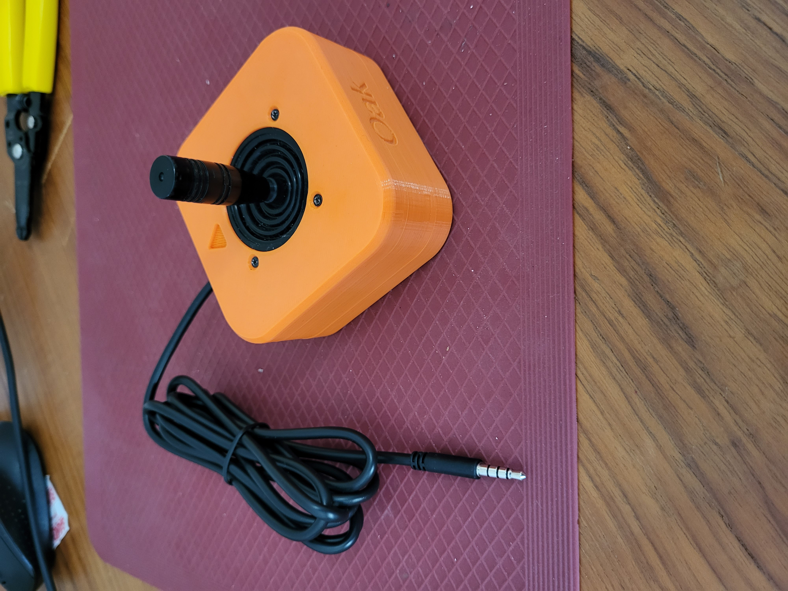

<!--- 
Open Source Assistive Technology: GitHub Readme Template
 --->

<!---
INSTRUCTIONS
This is a markdown template for creating the README.md file in a GitHub repository. This file is rendered and displayed automatically when someone visits the repository.

This document includes helper text that will not be displayed when rendered. Any text between the less-than sign + exclamation mark + three hyphen-minus (<!---) and matching three hyphen-minus + greater-than sign will not be displayed. This helper text can be deleted once the corresponding section is completed.

 --->
 
 <!--- 
TITLE
Should match the name of the GitHub repository. Choose something descriptive rather than whimsical. 
 --->
 # Oak Compact Joystick

<!--- 
SUMMARY
A brief summary of the project. What it does, who it is for, how much it costs.
 --->
The Oak Compact Joystick is a medium sized proportional joystick that can be used for adaptive gaming. It has range of motion of approximately ±25° and requires 525 grams-force to fully deflect. This joystick has a cable with a 3.5 mm TRRS audio plug (i.e., headphone jack). It is compatible with the X1 or X2 analog input ports on the Microsoft Xbox Adaptive controller as well as the [Forest Joystick Mouse Hub](https://github.com/makersmakingchange/Forest-Joystick-Mouse-Hub) and the [Enabled Controller](https://makersmakingchange.com/project/enabled-controller/).

<!--- 
PHOTO

 --->
 
 
Other available joysticks can be found through the [Joystick Selection Guide](https://makersmakingchange.com/resource/analog-joystick-selection-guide/)
<!--- 
## More info at
 - [Makers Making Change Forum Thread](TBD) 
 - [Makers Making Change Project Page](TBD)
 --->
## OpenAT Joysticks
This design is part of the [OpenAT Joystick project](https://github.com/makersmakingchange/OpenAT-Joysticks), a collection of open source designs for digital access and adapted gaming.  

## How to Obtain an Oak Compact Joystick
There are several options for obtaining the device.

### 1. Do it Yourself (DIY) or Do it Together (DIT)

This is an open-source assistive technology, so anyone is free to build it. All of the files and instructions required to build the Oak Compact Joystick are contained within this repository.

### 2. Request a build of this device

A limited number of these devices may be available at no-cost to people with disabilities that reside within Canada. If you think this applies to you, please send an email to info@makersmakingchange.com.

Once the device is finalized and published in the Makers Making Change library, it will also be possible to submit a build request to have a volunteer maker build the device. As the requestor, you are responsible for reimbursing the maker for the cost of materials and any shipping.
<!---
If you would like to obtain an Oak Compact Joystick, you may submit a build request through the [MMC Library Page](https://makersmakingchange.com/project/Oak-Compact-Joystick/). The requestor is responsible for the cost of materials and any shipping.
--->

### 3. How to build this device for someone else
Once the device is finalized and published in the Makers Making Change library, there is a plan to hold a number of build events in Canada. If you'd like to participate, send an email to info@makersmakingchange.com.

Once added to the library, if you have the skills and equipment to build this device, and would like to donate your time to create the device for someone who needs it, visit the [MMC Makers Wanted](https://makersmakingchange.com/maker-wanted/) section to fulfill build requests.

<!---
If you have the skills and equipment to build this device, and would like to donate your time to create the switch for someone who needs it, visit the [MMC Maker Wanted](https://makersmakingchange.com/maker-wanted/) section.
--->

## Getting Started

### 1. Read the Makers Checklist

The Makers Checklist in the [Maker Guide](/Documentation/Oak_Joystick_Maker_Guide.pdf) contains a list of tasks to complete to build the device.

### 2. Order the Off-The-Shelf Components

The [Oak Joystick Bill of Materials](/Documentation/Oak_Joystick_BOM.csv) lists all of the parts and components required to build the Oak Compact Joystick.

### 3. Print the 3D Printable components

Print the components needed for the Oak Compact Joystick. Make sure to ask the user if they would like any of the optional prints such as toppers or mount adapters. Refer to the [OpenAT Joystick Setup Guide](https://github.com/makersmakingchange/OpenAT-Joysticks/Resources/OpenAT_Joystick_Setup_Guide.pdf) for detailed mounting options.

All of the files and individual print files can be in the [/Build_Files/3D_Printing_Files](/Build_Files/3D_Printing_Files/) folder.

### 4. Assemble the Oak Compact Joystick

Reference the [Maker Guide](/Documentation/Oak_Joystick_Maker_Guide.pdf) for the tools and steps required to build each portion.

## Files
### Documentation
| Document             | Version | Link |
|----------------------|---------|------|
| Design Rationale     | 1.0     | [Oak_Compact_Joystick_Design_Rationale](/Documentation/Oak_Joystick_Design_Rationale.pdf)     |
| Bill of Materials    | 1.0     | [Oak_Compact_Joystick_Bill_of_Materials](/Documentation/Oak_Joystick_BOM.csv)     |
| Topper Sizing Guide  | 1.0     | [Oak_Compact_Joystick_Topper_Sizing_Guide](/Documentation/Oak_Joystick_Topper_Guide.pdf)
| Maker Guide          | 1.0     | [Oak_Compact_Joystick_Assembly_Guide](/Documentation/Oak_Joystick_Maker_Guide.pdf)     |
| User Guide           | 1.0     | [Oak_Compact_Joystick_User_Guide](/Documentation/Oak_Joystick_User_Guide.pdf)    |

### Design Files
<!---
DESIGN FILES
If possible, include a copy of original design files to facilitate easy editing and customization.
--->
 - [CAD Files](/Design_Files)

### Build Files
<!---
BUILD FILES
This section lists links to the various files used to build the device.
--->
 - [3D Printing Files](/Build_Files/3D_Print_files)

## License
<!---
LICENSE
Choose an appropriate license. We recommend an open-source hardware compatible license.
--->
Everything needed or used to design, make, test, or prepare the Oak Compact Joystick is licensed under the CERN 2.0 Weakly Reciprocal license <https://ohwr.org/project/cernohl/wikis/Documents/CERN-OHL-version-2> (CERN-OHL-W).

Accompanying material such as instruction manuals, videos, and other copyrightable works that are useful but not necessary to design, make, test, or prepare the Oak Compact Joystick are published under a Creative Commons Attribution-ShareAlike 4.0 license <https://creativecommons.org/licenses/by-sa/4.0/> (CC BY-SA 4.0).

## Attribution
<!---
ATTRIBUTION
Include any information related to the development of the design. This may include who identified the initial challenge, who contributed to the design
--->
Hardware, toppers, and enclosure design: Stephen Moyer, Neil Squire Society

The documentation template was created by Makers Making Change / Neil Squire and is used under a CC BY-SA 4.0 license. It is available at the following link: https://github.com/makersmakingchange/OpenAT-Template

## About Makers Making Change

Makers Making Change is an initiative of [Neil Squire](https://www.neilsquire.ca/), a Canadian non-profit that uses technology, knowledge, and passion to empower people with disabilities.

We are committed to cultivating a network of volunteer makers who support people with disabilities in their communities through cost effective assistive technology. Check out our library of free, open-source assistive technologies.

 - Website: [www.MakersMakingChange.com](https://www.makersmakingchange.com/)
 - [GitHub](https://github.com/makersmakingchange)
 - [Thingiverse](https://www.thingiverse.com/makersmakingchange/about)
 - Twitter: [@makermakechange](https://twitter.com/makermakechange)
 - Instagram: [@makersmakingchange](https://www.instagram.com/makersmakingchange)

### Contact Us
For technical questions, to get involved, or to share your experience we encourage you to visit [MMC Forum](https://forum.makersmakingchange.com) or contact info@makersmakingchange.com
