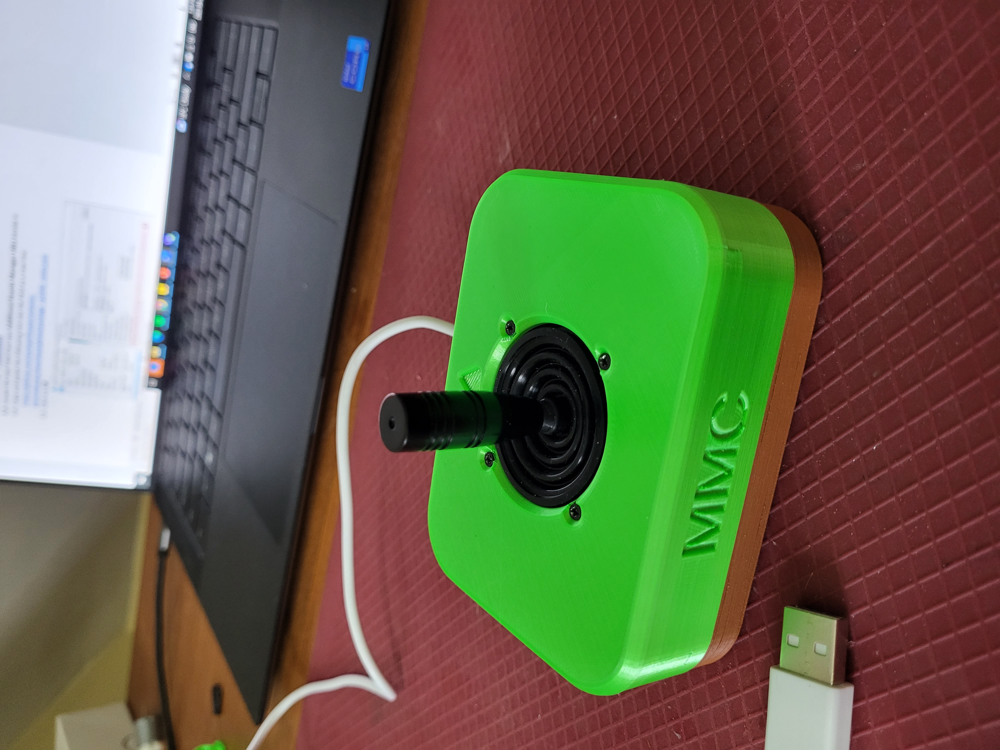

<!--- 
Open Source Assistive Technology: GitHub Readme Template
 --->

<!---
INSTRUCTIONS
This is a markdown template for creating the README.md file in a GitHub repository. This file is rendered and displayed automatically when someone visits the repository.

This document includes helper text that will not be displayed when rendered. Any text between the less-than sign + exclamation mark + three hyphen-minus (<!---) and matching three hyphen-minus + greater-than sign will not be displayed. This helper text can be deleted once the corresponding section is completed.

 --->
 
 <!--- 
TITLE
Should match the name of the GitHub repository. Choose something descriptive rather than whimsical. 
 --->
 # Oak Compact Joystick

<!--- 
SUMMARY
A brief summary of the project. What it does, who it is for, how much it costs.
 --->
The Oak Compact Joystick is a medium sized proportional joystick that can be used for adaptive gaming. It has range of motion of approximately ±25° and requires 525 grams-force to fully deflect. The Oak Compact Joystick is available in two variants: a USB variant (U) and a non-USB variant (A). The joystick and enclosure are the same in both variants and differ by the cable and internal electronics.

The USB variant (U) has a cable with a USB-A connector. It acts as a USB HID gamepad with a single joystick axis and is compatible with a variety of devices including PC and the USB ports of the Microsoft Xbox Adaptive Controller. The deadzone of this variant can be adjusted through a serial interface.

The non-USB variant (A) has a cable with a 3.5 mm TRRS audio plug (i.e., headphone jack). It is compatible with the X1 or X2 analog input ports on the Microsoft Xbox Adaptive controller as well as the [Enabled Controller](https://makersmakingchange.com/project/enabled-controller/).

The current version (v0.2) of the design is a fully functional and tested protoype. A number of updates are on the way:
- Integration of one or more switches for buttons
- Updated code for improved user response profiles
- Additional mounting options
- Additional topper options
- Basic mouse functionality

<!--- 
PHOTO

 --->
 
 

<!--- 
## More info at
 - [Makers Making Change Forum Thread](TBD) 
 - [Makers Making Change Project Page](TBD)
 --->

## Getting Started
<!--- 
Include an overall idea of what major steps are required to build the device.
 --->
### 1. Confirm which variant is required
The Oak Compact Joystick comes in both USB (U) and Non-USB (A) variants. The non-USB variant uses a TRRS cable to connect to an existing gamepad such as the Microsoft Xbox Adaptive Controller (XAC) or [Enabled Controller](https://makersmakingchange.com/project/enabled-controller/). The USB version has its own microcontroller and emulates an HID gamepad allowing for direct PC use as well as some customisation of the joystick response profile. Ask the user which one they would like. There are separate set of documentation for each joystick version.

Other available joysticks can be found through the [Joystick Selection Guide](https://makersmakingchange.com/resource/analog-joystick-selection-guide/)

### 2. Order the Off-The-Shelf Components
The Bill of Materials lists all of the parts and components required to build the Oak Compact Joystick. The mechanical components may be available locally, but will probably need to be ordered online. 

### 3. Print the 3D Printable components
Print the components for the Oak Compact Joystick enclosure.

All of the files and individual print files can be in the [/Build_Files/3D_Print_Files](/Build_Files/3D_Print_Files/) folder.

### 4. Assemble the Oak Compact Joystick
Reference the Assembly Guide for the tools and steps required to build each portion. 

## Files
<!---
FILES
This section includes all the information and files required to build and modify the device, including documentation, design files, and build files. 
--->

### Documentation
<!---
DOCUMENTATION

--->
| Document             | Version | Oak Compact Joystick - U 														| Oak Compact Joystick - A |
|----------------------|---------|--------------------------------------------------------------------------------------------------------------------------------------|-------------------------|
| Design Rationale     | 0.2     | [Oak_Compact_Joystick_Design_Rationale](/Documentation/Oak_Compact_Joystick_Design_Rationale.pdf)       	| [Oak_Compact_Joystick_Design_Rationale](/Documentation/Oak_Compact_Joystick_Design_Rationale.pdf)      |
| Maker Checklist      | 0.2     | [Oak_Compact_Joystick-U_Maker_Checklist](/Documentation/Oak_Compact_Joystick-U/Oak_Compact_Joystick-U_Maker_Checklist_v0.2.pdf)     	| [Oak_Compact_Joystick-A_Maker_Checklist](/Documentation/Oak_Compact_Joystick-A/Oak_Compact_Joystick-A_Maker_Checklist_v0.2.pdf)     |
| Bill of Materials    | 0.2     | [Oak_Compact_Joystick-U_Bill_of_Materials](/Documentation/Oak_Compact_Joystick-U/Oak_Compact_Joystick-U_BOM_v0.2.csv)     		| [Oak_Compact_Joystick-A_Bill_of_Materials](/Documentation/Oak_Compact_Joystick-A/Oak_Compact_Joystick-A_BOM_v0.2.csv)     |
| 3D Printing Guide    | 0.2     | [Oak_Compact_Joystick-U_3D_Printing_Guide](/Documentation/Oak_Compact_Joystick-U/Oak_Compact_Joystick-U_3D_Printing_Guide_v0.2.pdf)     | [Oak_Compact_Joystick-A_3D_Printing_Guide](/Documentation/Oak_Compact_Joystick-A/Oak_Compact_Joystick-A_3D_Printing_Guide_v0.2.pdf)     |
| Assembly Guide       | 0.2     | [Oak_Compact_Joystick-U_Assembly_Guide](/Documentation/Oak_Compact_Joystick-U/Oak_Compact_Joystick-U_Assembly_Guide_v0.2.pdf)     	| [Oak_Compact_Joystick-A_Assembly_Guide](/Documentation/Oak_Compact_Joystick-A/Oak_Compact_Joystick-A_Assembly_Guide_v0.2.pdf)     | 
| User Guide           | 0.2     | [Oak_Compact_Joystick-U_User_Guide](/Documentation/Oak_Compact_Joystick-U/Oak_Compact_Joystick-U_User_Guide_v0.2.pdf)    		| [Oak_Compact_Joystick-A_User_Guide](/Documentation/Oak_Compact_Joystick-A/Oak_Compact_Joystick-A_User_Guide_v0.2.pdf)    |
| Changelog            | 0.2     | [Oak_Compact_Joystick-U_Changelog](/Documentation/Oak_Compact_Joystick-U/Oak_Compact_Joystick_Changelog_v0.2.pdf)     			| [Oak_Compact_Joystick-A_Changelog](/Documentation/Oak_Compact_Joystick-A/Oak_Compact_Joystick_Changelog_v0.2.pdf)     |

### Design Files
<!---
DESIGN FILES
If possible, include a copy of original design files to facilitate easy editing and customization.
--->
 - [CAD Files](/Design_Files)

### Build Files
<!---
BUILD FILES
This section lists links to the various files used to build the device.
--->
 - [3D Printing Files](/Build_Files/3D_Print_files)
 - [Firmware](/Build_Files/OpenAT_Joystick_Software_Oak)

## License
<!---
LICENSE
Choose an appropriate license. We recommend an open-source hardware compatible license.
--->
Everything needed or used to design, make, test, or prepare the Oak Compact Joystick is licensed under the CERN 2.0 Weakly Reciprocal license <https://ohwr.org/project/cernohl/wikis/Documents/CERN-OHL-version-2> (CERN-OHL-W).

Accompanying material such as instruction manuals, videos, and other copyrightable works that are useful but not necessary to design, make, test, or prepare the Oak Compact Joystick are published under a Creative Commons Attribution-ShareAlike 4.0 license <https://creativecommons.org/licenses/by-sa/4.0/> (CC BY-SA 4.0).

## Attribution
<!---
ATTRIBUTION
Include any information related to the development of the design. This may include who identified the initial challenge, who contributed to the design
--->
Hardware and enclosure design: Stephen Moyer, Neil Squire
USB Variant software: Milad Hajihassan, Neil Squire

Goalpost Topper: Remixed from [Egon Heuson](https://www.printables.com/model/110455-xac-joysticks-and-universal-adapter)
Concave and Convex Toppers: Remixed from [Microsoft Adaptive Accessories](https://support.microsoft.com/en-us/topic/customize-your-microsoft-adaptive-accessories-with-3d-printed-designs-29ee6d7e-45f4-4730-bfe6-657c294d02ca)

The USB variant software utilizes the [Adafruit TinyUSB Library for Arduino](https://github.com/adafruit/Adafruit_TinyUSB_Arduino) which is made available under an [MIT license](https://github.com/adafruit/Adafruit_TinyUSB_Arduino/blob/master/LICENSE).
The documentation template was created by Makers Making Change / Neil Squire and is used under a CC BY-SA 4.0 license. It is available at the following link: https://github.com/makersmakingchange/OpenAT-Template

## About Makers Making Change

Makers Making Change is an initiative of [Neil Squire](https://www.neilsquire.ca/), a Canadian non-profit that uses technology, knowledge, and passion to empower people with disabilities.

We are committed to cultivating a network of volunteer makers who support people with disabilities in their communities through cost effective assistive technology. Check out our library of free, open-source assistive technologies.

 - Website: [www.MakersMakingChange.com](https://www.makersmakingchange.com/)
 - [GitHub](https://github.com/makersmakingchange)
 - [Thingiverse](https://www.thingiverse.com/makersmakingchange/about)
 - Twitter: [@makermakechange](https://twitter.com/makermakechange)
 - Instagram: [@makersmakingchange](https://www.instagram.com/makersmakingchange)

### Contact Us
For technical questions, to get involved, or to share your experience we encourage you to visit [MMC Forum](https://forum.makersmakingchange.com) or contact info@makersmakingchange.com
