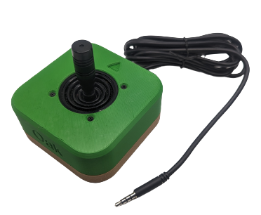

 # Oak Compact Joystick

<!--- 
SUMMARY
A brief summary of the project. What it does, who it is for, how much it costs.
 --->
The Oak Compact Joystick is a medium sized proportional joystick that can be used for adaptive gaming. It has range of motion of approximately ±25° and requires 525 grams-force to fully deflect. This joystick has a cable with a 3.5 mm TRRS audio plug (i.e., headphone jack). It is compatible Microsoft Xbox Adaptive controller as well as the [Forest Joystick Mouse Hub](https://github.com/makersmakingchange/Forest-Joystick-Mouse-Hub) and the [Enabled Controller](https://makersmakingchange.com/project/enabled-controller/).

The Oak Compact Joystick can be used directly as a left or right thumbstick for the Microsoft Xbox Adaptive Controller (XAC) using the X1 or X2 analog input ports. It can also be used with the [Forest Joystick Mouse Hub](https://github.com/makersmakingchange/Forest-Joystick-Mouse-Hub) as a USB Gamepad or USB Mouse.

The Oak Compact Joystick has a set of easily swappable, modular toppers that can be added to make the joystick easier or more comfortable to use.

The Oak Compact Joystick is open assistive technology (OpenAT). Under the terms of the open source licenses, the device may be built, used, and improved upon by anyone.

The current version of the Oak Compact Joystick (v1.0) has been built and user tested.

<!--- 
PHOTO
 --->
 
 
<!--- 
Other available joysticks can be found through the [Joystick Selection Guide](https://makersmakingchange.com/resource/analog-joystick-selection-guide/)
--->

Makers Making Change Assistive Device Library Listing: https://www.makersmakingchange.com/s/product/oak-compact-joystick/01tJR00000092x3YAA

## OpenAT Joysticks
This design is part of the [OpenAT Joystick Project](https://github.com/makersmakingchange/OpenAT-Joysticks), a collection of open source designs for digital access and adapted gaming.  

## How to Obtain an Oak Compact Joystick
There are several options for obtaining the device.

### 1. Do it Yourself (DIY) or Do it Together (DIT)

This is an open-source assistive technology, so anyone is free to build it. All of the files and instructions required to build the Oak Compact Joystick are contained within this repository.

### 2. Request a build of this device

If you would like to obtain an Oak Compact Joystick, you may submit a build request through the [MMC Library Listing](https://www.makersmakingchange.com/s/product/oak-compact-joystick/01tJR00000092x3YAA). The requestor is responsible for the cost of materials and any shipping.

A limited number of these devices may be available at no-cost to people with disabilities that reside within Canada as part of the [Accesible Technology Program Grant](https://ised-isde.canada.ca/site/accessible-technology-program/en). If you think this applies to you, please send an email to info@makersmakingchange.com.

### 3. How to build this device for someone else
If you have the skills and equipment to build this device, and would like to donate your time to create the device for someone who needs it, visit the [MMC Maker Wanted](https://makersmakingchange.com/maker-wanted/) section.

## Getting Started

### 1. Read the Makers Checklist

The Makers Checklist in the [Maker Guide](/Documentation/Oak_Joystick_Maker_Guide.pdf) contains a list of tasks to complete to build the device.

### 2. Order the Off-The-Shelf Components

The [Oak Joystick Bill of Materials](/Documentation/Oak_Joystick_BOM.csv) lists all of the parts and components required to build the Oak Compact Joystick.

### 3. Print the 3D Printable components

Print the components needed for the Oak Compact Joystick. Make sure to ask the user if they would like any of the optional prints such as toppers or mount adapters. Refer to the [OpenAT Joystick Setup Guide](https://github.com/makersmakingchange/OpenAT-Joysticks/Resources/OpenAT_Joystick_Setup_Guide.pdf) for detailed mounting options.

All of the files and individual print files can be in the [/Build_Files/3D_Printing_Files](/Build_Files/3D_Printing_Files/) folder.

### 4. Assemble the Oak Compact Joystick

Reference the [Maker Guide](/Documentation/Oak_Joystick_Maker_Guide.pdf) for the tools and steps required to build each portion.

## Files
### Documentation
| Document             | Version | Link |
|----------------------|---------|------|
| Design Rationale     | 1.0     | [Oak_Compact_Joystick_Design_Rationale](/Documentation/Oak_Joystick_Design_Rationale.pdf)     |
| Bill of Materials    | 1.0     | [Oak_Compact_Joystick_Bill_of_Materials](/Documentation/Oak_Joystick_BOM.csv)     |
| Topper Sizing Guide  | 1.0     | [Oak_Compact_Joystick_Topper_Guide](/Documentation/Oak_Joystick_Topper_Guide.pdf)
| Maker Guide          | 1.0     | [Oak_Compact_Joystick_Maker_Guide](/Documentation/Oak_Joystick_Maker_Guide.pdf)     |
| User Guide           | 1.0     | [Oak_Compact_Joystick_User_Guide](/Documentation/Oak_Joystick_User_Guide.pdf)    |

### Design Files
<!---
DESIGN FILES
If possible, include a copy of original design files to facilitate easy editing and customization.
--->
 - [CAD Files](/Design_Files)

### Build Files
<!---
BUILD FILES
This section lists links to the various files used to build the device.
--->
 - [3D Printing Files](/Build_Files/3D_Printing_files)

## License
<!---
LICENSE
Choose an appropriate license. We recommend an open-source hardware compatible license.
--->
Everything needed or used to design, make, test, or prepare the Oak Compact Joystick is licensed under the CERN 2.0 Weakly Reciprocal license <https://ohwr.org/project/cernohl/wikis/Documents/CERN-OHL-version-2> (CERN-OHL-W).

Accompanying material such as instruction manuals, videos, and other copyrightable works that are useful but not necessary to design, make, test, or prepare the Oak Compact Joystick are published under a Creative Commons Attribution-ShareAlike 4.0 license <https://creativecommons.org/licenses/by-sa/4.0/> (CC BY-SA 4.0).

Copyright (c) 2023 Neil Squire Society.

This repository describes Open Hardware:
 - Everything needed or used to design, make, test, or prepare the Oak Compact Joystick is licensed under the [CERN 2.0 Weakly Reciprocal license (CERN-OHL-W v2) or later](https://cern.ch/cern-ohl ) .
 - All software is under the [GNU General Public License v3.0 (GPL-3.0)](https://www.gnu.org/licenses/gpl.html).
 - Accompanying material such as instruction manuals, videos, and other copyrightable works that are useful but not necessary to design, make, test, or prepare the Oak Compact Joystick are published under a [Creative Commons Attribution-ShareAlike 4.0 license (CC BY-SA 4.0)](https://creativecommons.org/licenses/by-sa/4.0/) .

You may redistribute and modify this documentation and make products using it under the terms of the [CERN-OHL-W v2](https://cern.ch/cern-ohl).
This documentation is distributed WITHOUT ANY EXPRESS OR IMPLIED WARRANTY, INCLUDING OF MERCHANTABILITY, SATISFACTORY QUALITY AND FITNESS FOR A PARTICULAR PURPOSE.
Please see the CERN-OHL-W v2 for applicable conditions.

Source Location: https://github.com/makersmakingchange/Oak-Compact-Joystick

## Attribution
<!---
ATTRIBUTION
Include any information related to the development of the design. This may include who identified the initial challenge, who contributed to the design
--->
The documentation template was created by the Makers Making Change program of the Neil Squire Society and is used under a CC BY-SA 4.0 license. It is available at the following link: https://github.com/makersmakingchange/OpenAT-Template

### Contributors
- Stephen Moyer, Neil Squire Society. Design of hardware, enclosure, toppers. Documentation.
- Jake McIvor, Neil Squire Society. Testing and documentation.
- Tyler Fentie, Neil Squire Society. Testing.
- Josie Versloot, Neil Squire Society. Testing.

---
## About Makers Making Change

Makers Making Change is a program of [Neil Squire](https://www.neilsquire.ca/), a Canadian non-profit that uses technology, knowledge, and passion to empower people with disabilities.

Makers Making Change leverages the capacity of community based Makers, Disability Professionals and Volunteers to develop and deliver affordable Open Source Assistive Technologies.

 - Website: [www.MakersMakingChange.com](https://www.makersmakingchange.com/)
 - GitHub: [makersmakingchange](https://github.com/makersmakingchange)
 - Twitter: [@makermakechange](https://twitter.com/makermakechange)
 - Instagram: [@makersmakingchange](https://www.instagram.com/makersmakingchange)
 - Facebook: [makersmakechange](https://www.facebook.com/makersmakechange)
 - LinkedIn: [Neil Squire Society](https://www.linkedin.com/company/neil-squire-society/)
 - Thingiverse: [makersmakingchange](https://www.thingiverse.com/makersmakingchange/about)
 - Printables: [MakersMakingChange](https://www.printables.com/@MakersMakingChange)

### Contact Us
For technical questions, to get involved, or to share your experience we encourage you to [visit our website](https://www.makersmakingchange.com/) or [contact us](https://www.makersmakingchange.com/s/contact).
