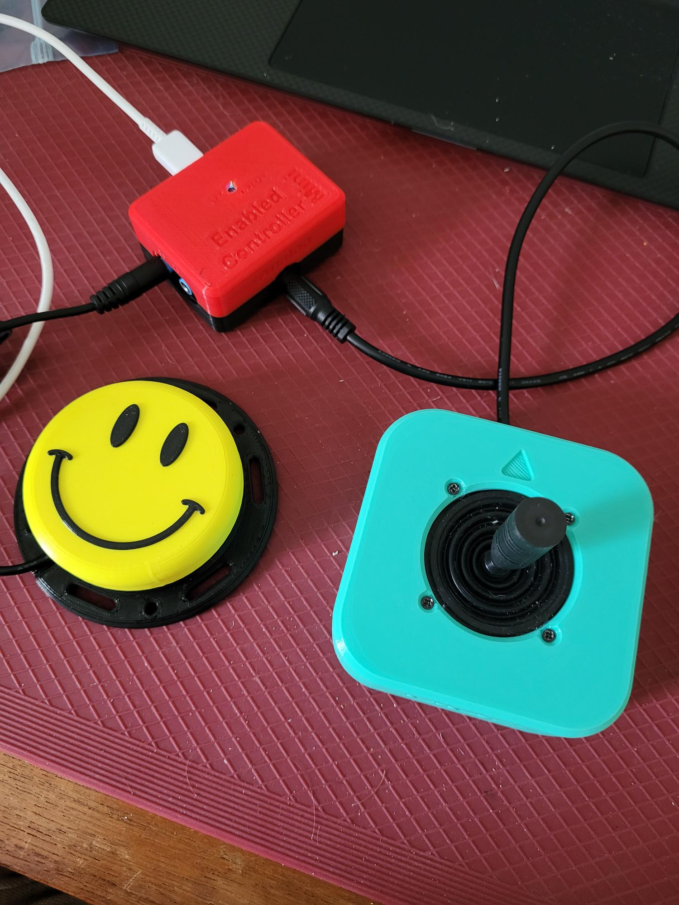

<!--- 
Open Source Assistive Technology: GitHub Readme Template
 --->

<!---
INSTRUCTIONS
This is a markdown template for creating the README.md file in a GitHub repository. This file is rendered and displayed automatically when someone visits the repository.

This document includes helper text that will not be displayed when rendered. Any text between the less-than sign + exclamation mark + three hyphen-minus (<!---) and matching three hyphen-minus + greater-than sign will not be displayed. This helper text can be deleted once the corresponding section is completed.

 --->
 
 <!--- 
TITLE
Should match the name of the GitHub repository. Choose something descriptive rather than whimsical. 
 --->
 # Oak Compact Joystick

<!--- 
SUMMARY
A brief summary of the project. What it does, who it is for, how much it costs.
 --->
The Oak Compact Joystick is a medium sized proportional joystick that can be used for adaptive gaming. It has range of motion of approximately ±25° and requires 525 grams-force to fully deflect. 

The Oak Compact Joystick v0.9 features the OakCompact Joystick - A paired with the [Enabled Controller Mini](https://github.com/milador/Enabled-Controller-Mini/tree/main) to create a USB mouse, or a gamepad with 4 buttons. The specific mouse and gamepad software can be found in [/Build_Files/Software](/Build_Files/Software).

The current version (v0.9) of the design is a protoype design. A number of updates are on the way:
- Updated code for improved user response profiles
- Additional mounting options

<!--- 
PHOTO

 --->
 
 

<!--- 
## More info at
 - [Makers Making Change Forum Thread](TBD) 
 - [Makers Making Change Project Page](TBD)
 --->

## OpenAT Joysticks
This design is part of the [OpenAT Joystick project](https://github.com/makersmakingchange/OpenAT-Joysticks), a collection of open source designs for digital access and adapted gaming.  

## How to Obtain an Oak Compact Joystick - A and Enabled Controller Mini
There are several options for obtaining the device.
### 1. Do it Yourself (DIY) or Do it Together (DIT)

This is an open-source assistive technology, so anyone is free to build it. All of the files and instructions required to build the Oak Compact Joystick - A and program the Enabled Controller Mini are contained within this repository. The files and instructions to build the Enabled Controller Mini can be found in the [Enabled Controller Mini Repository](https://github.com/milador/Enabled-Controller-Mini/tree/main) Refer to the Maker Checklist below.

### 2. Request a build of this device

A limited number of these devices may be available at no-cost to people with disabilities that reside within Canada. If you think this applies to you, please send an email to info@makersmakingchange.com.

Once the device is finalized and published in the Makers Making Change library, it will also be possible to submit a build request to have a volunteer maker build the device. As the requestor, you are responsible for reimbursing the maker for the cost of materials and any shipping.
<!---
If you would like to obtain an Oak Compact Joystick - A and Enabled Controller Mini, you may submit a build request through the [MMC Library Page](https://makersmakingchange.com/project/Oak-Compact-Joystick/). The requestor is responsible for the cost of materials and any shipping.
--->

### 3. How to build this device for someone else
Once the device is finalized and published in the Makers Making Change library, there is a plan to hold a number of build events in Canada. If you'd like to participate, send an email to info@makersmakingchange.com.

Once added to the library, if you have the skills and equipment to build this device, and would like to donate your time to create the device for someone who needs it, visit the [MMC Makers Wanted](https://makersmakingchange.com/maker-wanted/) section to fulfill build requests.

<!---
If you have the skills and equipment to build this device, and would like to donate your time to create the switch for someone who needs it, visit the [MMC Maker Wanted](https://makersmakingchange.com/maker-wanted/) section.
--->

## Getting Started

### 1. Read the Makers Checklist

The Makers Checklist contains a list of tasks to complete to build the device.

### 2. Order the Off-The-Shelf Components

The [Oak-A Bill of Materials](/Documentation/Oak_Compact_Joystick-A_BOM.csv) lists all of the parts and components required to build the Oak Compact Joystick - A. For the Enabled Controller Mini BOM and PCB ordering instructions, see the [Enabled Controller Mini Repository](https://github.com/milador/Enabled-Controller-Mini/tree/main).

### 3. Print the 3D Printable components

Print the components needed for the Oak Compact Joystick and Enabled Controller Mini. Make sure to ask the user if they would like any of the optional prints such as toppers or mount adapters.

All of the files and individual print files can be in the [/Build_Files/3D_Printing_Files](/Build_Files/3D_Printing_Files/) folder.

### 4. Assemble the Cedar Mini Joystick

Reference the [Assembly Guide](/Documentation/Oak_Compact_Joystick-A_Assembly_Guide.pdf) for the tools and steps required to build each portion.

## Files
### Documentation
| Document             | Version | Link |
|----------------------|---------|------|
| Design Rationale     | 0.9     | [Oak_Compact_Joystick_Design_Rationale](/Documentation/Oak_Compact_Joystick_Design_Rationale_v0.9.pdf)     |
| Bill of Materials    | 0.9     | [Oak_Compact_Joystick_Bill_of_Materials](/Documentation/Oak_Compact_Joystick-A_BOM.csv)     |
| Topper Sizing Guide  | 0.9     | [Oak_Compact_Joystick_Topper_Sizing_Guide](/Documentation/Oak_Compact_Joystick_Topper_Sizing_Guide.pdf)
| 3D Printing Guide    | 0.9     | [Oak_Compact_Joystick_3D_Printing_Guide](/Documentation/Oak_Compact_Joystick-A_3D_Printing_Guide.pdf)     |
| Assembly Guide       | 0.9     | [Oak_Compact_Joystick_Assembly_Guide](/Documentation/Oak_Compact_Joystick-A_Assembly_Guide.pdf)     |
| User Guide           | 0.9     | [Oak_Compact_Joystick_User_Guide](/Documentation/Oak_Compact_Joystick_User_Guide.pdf)    |

### Design Files
[CAD Files](/Design_Files)

### Build Files
 - [3D Printing Files](/Build_Files/3D_Printing_Files)

## Attribution
Hardware and enclosure design: Stephen Moyer, Neil Squire

Software: Milad Hajihassan, Neil Squire; Josie Versloot, Neil Squire; and Stephen Moyer, Neil Squire

Enabled Controller Mini design: Milad Hajihassan, Neil Squire

The software utilizes the [Adafruit TinyUSB Library for Arduino](https://github.com/adafruit/Adafruit_TinyUSB_Arduino) which is made available under an [MIT license](https://github.com/adafruit/Adafruit_TinyUSB_Arduino/blob/master/LICENSE).

The documentation template was created by Makers Making Change / Neil Squire and is used under a CC BY-SA 4.0 license. It is available at the following link: https://github.com/makersmakingchange/OpenAT-Template

## License
Everything needed or used to design, make, test, or prepare the Oak Compact Joystick is licensed under the CERN 2.0 Weakly Reciprocal license https://ohwr.org/project/cernohl/wikis/Documents/CERN-OHL-version-2 (CERN-OHL-W).

Accompanying material such as instruction manuals, videos, and other copyrightable works that are useful but not necessary to design, make, test, or prepare the Oak Compact Joystick are published under a Creative Commons Attribution-ShareAlike 4.0 license https://creativecommons.org/licenses/by-sa/4.0/ (CC BY-SA 4.0).

---

## About Makers Making Change

Makers Making Change is an initiative of [Neil Squire](https://www.neilsquire.ca/), a Canadian non-profit that empowers people with disabilities.

We are committed to creating a network of volunteer makers who support people with disabilities in their communities through 3D printing assistive devices. Check out our library of free, open-source assistive technologies with parts and build instructions.

 - Website: [www.MakersMakingChange.com](https://www.makersmakingchange.com/)
 - GitHub: [https://github.com/makersmakingchange](https://github.com/makersmakingchange)
 - Twitter: [@makermakechange](https://twitter.com/makermakechange)
 - Instagram: [@makersmakingchange](https://www.instagram.com/makersmakingchange)

## Contact Us

For technical questions, to get involved, or share your experience we encourage you to visit the [MMC Website](https://www.makersmakingchange.com/), [MMC Forum](https://makersmakingchange.com/forum), or contact info@makersmakingchange.com
